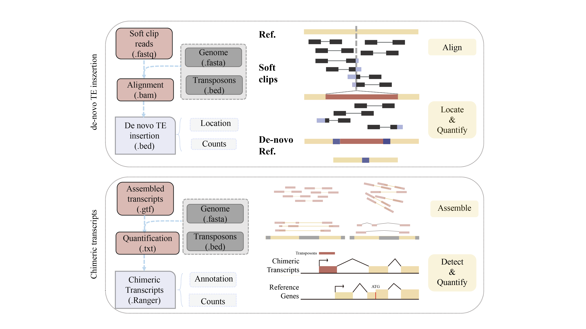

# **TEDDY**
# **T**ransposable **e**lement **d**e novo insertion **detecting** and chimeric transcripts identif**y**ing
**TEDDY** is a framework for TE insertion detection and chimeric transcripts identification.
<p align="center">

</p>


## 1.Getting Started
**1.1 Preparation**
To compile C code, use the following steps:
```{shell prepare, warning=FALSE, eval=FALSE,message=FALSE}
cd Teddy
cd Teddy/src
make
```
**1.2 Installation**
```{shell install, warning=FALSE, eval=FALSE,message=FALSE}
cd ../..
R CMD INSTALL Teddy
```
## 2. Initialization
```{r init, warning=FALSE, eval=FALSE,message=FALSE}
library(Teddy)
```

## 3. Identify chimeric transcripts
**3.1 Assemble reads into transcripts by Stringtie**
```{r assemble, warning=FALSE, eval=FALSE, message=FALSE}
Teddy::stringtieAssembly(bam = bam, reference = reference, outfile = outfile)
```

**3.2 Merge various GTF files among different samples for a unified newly assembled reference**
```{r merge, warning=FALSE, eval=FALSE, message=FALSE}
Teddy::stringtieMerge(reference = reference, gtfFiles = gtfFiles, outfile = N_reference)
```

**3.3 Annotate the newly assembled reference via the genome reference**
```{r anno, warning=FALSE, eval=FALSE, message=FALSE}
Teddy::gffcompareAnno(reference = reference, gtfFile = N_reference, outfile = annoGTF)
```

**3.4 Flatten the transcripts into counting bins and annotate them via the annotated TE reference as a GRanges obejct**
```{r repeats, warning=FALSE, eval=FALSE, message=FALSE}
anno <- Teddy::prepareAnno(gtffile = N_reference, transposon = transposon)
```

**3.5 Count the reads falling into the counting bins among bam files**
```{r count, warning=FALSE, eval=FALSE, message=FALSE}
se <- countAnno(annotation = anno, bamfiles = bamfile, nthreads = 5)
```

**3.6  Count the reads falling into the transcripts among bam files**
```{r count2, warning=FALSE, eval=FALSE, message=FALSE}
combineSE <- stringtieCombine(reference = N_reference, 
                              bamfile = bamfiles,
                              params = "-p 70", 
                              gtfFiles = gtfFiles)
```

**3.7 Detect to what extent TE-chimeric exon affect the expression of the corresponding transcript**

3.7.1 Fit the counts with the formula ~sample + TE-chimeric + condition:TE-chimeric and compare it to the null model ~ sample + TE-chimeric. TE-chimeric is a factor with two levels, which classified the exon as TE-chimeric exon or other exon. Compare the deviances of two GLM fits for each counting bin through χ2-distribution test and extract the result from the test .
```{r test, warning=FALSE, eval=FALSE, message=FALSE}
chi_test <- ChimericDrivenTest(SEobject = se, condition = condition)
results <- extractTest(object = chi_test)
```

3.7.2 Estimate relative fold changes of counts in the TE-chimeric exon among different conditions and versus other exons, calculated by a GLM fit based on the formula count ~ condition + TE-chimeric + condition:TE-chimeric. The interaction coefficient reflects that the fraction of the gene's reads of TE-chimeric exon differs significantly between the different experimental conditions. That is, TE-chimeric transcripts may play a role under different biological conditions. 
```{r foldchange, warning=FALSE, eval=FALSE, message=FALSE}
calculateFoldchange(object = chi_test, genes = genes, crossVar="condition")
```

**3.8 Visualize Form and Expression Fluctuation of TE-chimeric Transcripts**

3.8.1 To investigate the structural form and expression changes of TE-chimeric transcripts, TEDDY includes the formPlot function. This tool is designed to visualize how transposable elements (TEs) integrate within specific transcripts.
```{r vis1, warning=FALSE, eval=FALSE, message=FALSE}
formPlot(GTF = GTF, txid = txid, rank = 1,geneName = geneName,TEname = TEname)
```
3.8.2 Plotting Gene Body and Specific Isoform Structure and Expression
To visualize the structure of a gene body and the expression of a specific isoform, particularly showcasing the results of the previously mentioned `ChimericDrivenTest`, the `diffBinPlot` function is developed. This function generates a plot that highlights the gene body and isoform structure against the backdrop of expression levels, effectively visualizing the impact of TE-chimeric events on the expression.
```{r vis2, warning=FALSE, eval=FALSE, message=FALSE}
diffBinPlot(count = count, conditions = condition, annotation = anno,
            idx = geneIndex, 
            gtf = N_reference,
            txid = txid,
            chi_test = chi_test)
```

**3.9 Search the motif binding sites of TE-chimeric transcripts**

TEDDY enables the identification of motif binding sites within TE-chimeric transcripts, leveraging the `pcmFunction` to convert motifs of interest from probability matrix (PCM) to position weight matrix (PWM) format. This PWM can then be used as an input for motif search. By applying various thresholds for filtering and integrating other epigenetic data, users can construct potential motif networks that offer insights into the regulatory mechanisms of TE-chimeric transcripts.

To perform motif search on TE-chimeric transcripts, the `MotifSearch` function can be utilized as follows:


```{r motif, warning=FALSE, eval=FALSE, message=FALSE}
MotifSearch(object = object, te = te, pwm = pwm, filter = filter, min.score = min.score)
```
