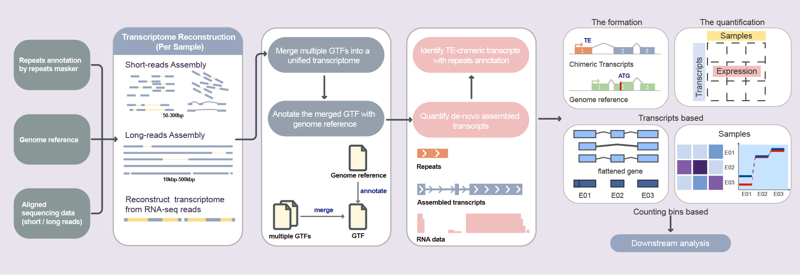

# TEDDY

## **T**ransposable **E**lement-**D**epen**D**ent isoform anal**Y**sis framework

<p align="center">
  
</p>

## 1. Getting Started

### 1.1 Installation

TEDDY can be installed either from Bioconda or from source.

#### Option 1: Install from Bioconda

For users who prefer an environment-managed installation, TEDDY is available through Bioconda:

```bash
conda install bioconda::r-teddy
```

This option installs TEDDY together with its Conda-resolved package dependencies.

Genome-specific `BSgenome` packages are not fixed dependencies of TEDDY, because the appropriate genome sequence depends on the species and genome build used in each analysis. If you use sequence extraction or motif-search functions, please install the corresponding `BSgenome` package separately.

For example, for mouse mm10:

```r
BiocManager::install("BSgenome.Mmusculus.UCSC.mm10")
```

For human hg38:

```r
BiocManager::install("BSgenome.Hsapiens.UCSC.hg38")
```

#### Option 2: Install from source

If you install TEDDY from source, please install the required R dependencies first.

**Step 1: Install R dependencies**

Open an R console and run:

```r
if (!require("BiocManager", quietly = TRUE)) {
    install.packages("BiocManager")
}

bioc_deps <- c(
  "rtracklayer", "GenomicFeatures", "Rsamtools",
  "GenomicAlignments", "GenomicRanges", "IRanges",
  "S4Vectors", "SummarizedExperiment", "Rsubread",
  "DESeq2", "statmod", "BiocParallel", "MatrixGenerics"
)

BiocManager::install(bioc_deps)
```

**Step 2: Compile bundled C/C++ components**

In the terminal, run:

```bash
cd Teddy/src
make -j8
```

All required bundled libraries and external components are compiled from source during this step. The `-j` option enables parallel compilation; adjust the number of jobs according to your local machine or server environment.

**Step 3: Install TEDDY**

Return to the parent directory and install the package:

```bash
cd ../..
R CMD INSTALL Teddy
```

If you are already inside the `Teddy` directory, use:

```bash
R CMD INSTALL .
```

### 1.2 Troubleshooting Compilation

If you encounter build errors during compilation, especially after switching machines or modifying source files, clean previously compiled artifacts before rebuilding:

```bash
cd Teddy/src
make clean
make -j8
```

## 2. Initialization

```r
library(Teddy)
```

## 3. Identify chimeric transcripts

### 3.1 Assemble reads into transcripts by StringTie

```r
Teddy::stringtieAssembly(bam = bam, reference = reference, outfile = outfile)
```

### 3.2 Merge various GTF files among different samples for a unified newly assembled reference

```r
Teddy::stringtieMerge(reference = reference, gtfFiles = gtfFiles, outfile = N_reference)
```

### 3.3 Annotate the newly assembled reference via the genome reference

```r
Teddy::gffcompareAnno(reference = reference, gtfFile = N_reference, outfile = annoGTF)
```

### 3.4 Flatten the transcripts into counting bins and annotate them via the annotated TE reference as a GRanges object

```r
anno <- Teddy::prepareAnno(gtffile = N_reference, transposon = transposon)
```

### 3.5 Count the reads falling into the counting bins among bam files

```r
se <- countAnno(annotation = anno, bamfiles = bamfile, nthreads = 5)
```

### 3.6 Count the reads falling into the transcripts among bam files

```r
combineSE <- stringtieCombine(reference = N_reference, 
                              bamfile = bamfiles,
                              params = "-p 70", 
                              gtfFiles = gtfFiles)
```

### 3.7 Detect to what extent TE-chimeric exon affect the expression of the corresponding transcript

**3.7.1** Fit the counts with the formula `~sample + TE-chimeric + condition:TE-chimeric` and compare it to the null model `~ sample + TE-chimeric`. TE-chimeric is a factor with two levels, which classified the exon as TE-chimeric exon or other exon. Compare the deviances of two GLM fits for each counting bin through χ2-distribution test and extract the result from the test.

```r
chi_test <- ChimericDrivenTest(SEobject = se, condition = condition)
results <- extractTest(object = chi_test)
```

**3.7.2** Estimate relative fold changes of counts in the TE-chimeric exon among different conditions and versus other exons, calculated by a GLM fit based on the formula `count ~ condition + TE-chimeric + condition:TE-chimeric`. The interaction coefficient reflects that the fraction of the gene's reads of TE-chimeric exon differs significantly between the different experimental conditions. That is, TE-chimeric transcripts may play a role under different biological conditions. 

```r
calculateFoldchange(object = chi_test, genes = genes, crossVar="condition")
```

### 3.8 Visualize Form and Expression Fluctuation of TE-chimeric Transcripts

**3.8.1** 

To investigate the structural form and expression changes of TE-chimeric transcripts, TEDDY includes the `formPlot` function. This tool is designed to visualize how transposable elements (TEs) integrate within specific transcripts.

```r
formPlot(GTF = GTF, txid = txid, rank = 1, geneName = geneName, TEname = TEname)
```

**3.8.2 Plotting Gene Body and Specific Isoform Structure and Expression**

To visualize the structure of a gene body and the expression of a specific isoform, particularly showcasing the results of the previously mentioned `ChimericDrivenTest`, the `diffBinPlot` function is developed. This function generates a plot that highlights the gene body and isoform structure against the backdrop of expression levels, effectively visualizing the impact of TE-chimeric events on the expression.

```r
diffBinPlot(count = count, conditions = condition, annotation = anno,
            idx = geneIndex, 
            gtf = N_reference,
            txid = txid,
            chi_test = chi_test)
```

### 3.9 Search the motif binding sites of TE-chimeric transcripts

TEDDY enables the identification of motif binding sites within TE-chimeric transcripts, leveraging the `pcmFunction` to convert motifs of interest from probability matrix (PCM) to position weight matrix (PWM) format. This PWM can then be used as an input for motif search. By applying various thresholds for filtering and integrating other epigenetic data, users can construct potential motif networks that offer insights into the regulatory mechanisms of TE-chimeric transcripts.

To perform motif search on TE-chimeric transcripts, the `MotifSearch` function can be utilized as follows:

```r
MotifSearch(object = object, te = te, pwm = pwm, filter = filter, min.score = min.score)
```

## Teddy outputs at a glance

| Level | Steps / Functions |   Key Inputs  | Key Outputs | Object | Primary use | Notes |
|-----------------|-------------------|------------------|---------------------|------------------|----------------------|---------------|
| **A. <br>Reference & Annotation** | `stringtieMerge()`<br><br><br>`gffcompareAnno()`<br><br><br>`prepareAnno()` | Per-sample GTF(optional reference); <br><br>Reference GTF+merged GTF<br><br>Annotated  GTF + TE annotation (GRanges) |  Unified transcript reference <br><br><br>Annotated transcript reference<br><br><br>Flattened exon bins with TE labels | Merged GTF<br><br><br>Annotated merged GTF<br><br><br>GRanges object | Provide unified reference<br><br><br>Label known vs novel isoforms<br><br><br>Enable exon -level counting  | Ensure consistent chromosome naming <br><br><br>Preserve `transcript_id` / `gene_id`<br><br><br>Match `seqlevelsStyle` with BAM & TE |
| **B. <br>Exon-level counts** | `countAnno()` |  Flattened annotation  + BAM files |  Exon-bin × sample  count matrix |  SummarizedExperiment object  | Exon-level QC and downstream analyses | Use correct `isLongRead` / `isPairedEnd` by platform |
| **C. <br>Transcript-level abundance** | `stringtieCombine()` | Annotated merged GTF + BAM files； + Per-sample GTFs | Transcript-level abundance estimates + full GTF | SummarizedExperiment object | Cross-platform expression & structure analysis | Use `longRead=TRUE` for ONT/PacBio; ensure rownames = `transcript_id` |


## Tutorials

For step-by-step workflows, see the detailed tutorials:

- [TEDDY core workflow](articles/core-workflow.html)
- [TEDDY downstream analysis](articles/downstream-analysis.html)
