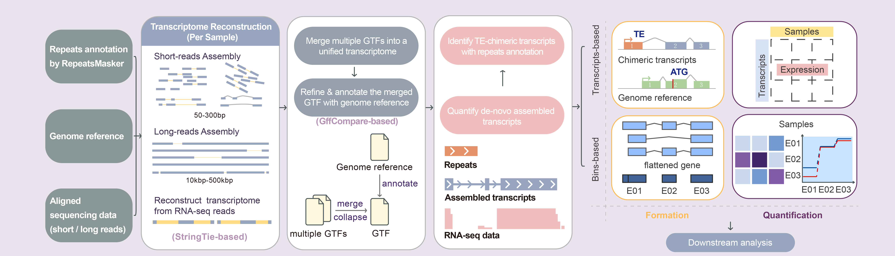

# **TEDDY**
# **T**ransposable **E**lement-**D**epen**D**ent isoform anal**Y**sis framework
<p align="center">

</p>


## 1. Getting Started

**1.1 Preparation**

To compile Teddy and all dependencies:

```{shell prepare2, warning=FALSE, eval=FALSE, message=FALSE}
cd Teddy
cd src && make -j
```

All required libraries (libdeflate, xz, bzip2) are included under `src/deps`, and will be compiled automatically.

**1.2 Installation**

Since `Teddy` relies on several bioinformatics packages from Bioconductor, you need to install these dependencies first before installing the `Teddy` package itself.

**Step 1: Install Dependencies (in R console)**

Please open your R console and run the following commands to ensure all required packages are installed:

```{r install_deps, warning=FALSE, eval=FALSE, message=FALSE}
# Install BiocManager if not already installed
if (!require("BiocManager", quietly = TRUE))
    install.packages("BiocManager")

# Install required dependencies from Bioconductor
BiocManager::install(c(
  "rtracklayer", "GenomicFeatures", "Rsamtools", 
  "GenomicAlignments", "GenomicRanges", "IRanges", 
  "S4Vectors", "SummarizedExperiment", "Rsubread", 
  "DESeq2", "statmod", "BiocParallel", "MatrixGenerics"
))

# Install the default mouse genome package used by Teddy
BiocManager::install("BSgenome.Mmusculus.UCSC.mm10")
```

> **Note on Reference Genomes:** `Teddy` uses the mouse genome (`mm10`) as the default parameter in some functions. If you are working with other species (e.g., Human `hg38`), you will need to install the corresponding `BSgenome` package and specify it in the function arguments.

**Step 2: Install Teddy (in Terminal)**

After the dependencies are installed and the preparation step is complete, return to your terminal. Navigate back to the parent directory and install the package:

```{shell install_teddy, warning=FALSE, eval=FALSE, message=FALSE}
cd ../..
R CMD INSTALL Teddy
```

*(Note: If you have already navigated inside the `Teddy` folder, you should use `R CMD INSTALL .` instead.)*

**1.3 Troubleshooting Compilation**
If you encounter build errors during compilation, especially after switching machines or modifying source files, consider cleaning previously compiled artifacts before rebuilding:

```bash
make clean
make -j
```

## 2. Initialization
```{r init, warning=FALSE, eval=FALSE,message=FALSE}
library(Teddy)
```

## 3. Identify chimeric transcripts
**3.1 Assemble reads into transcripts by Stringtie**
```{r assemble, warning=FALSE, eval=FALSE, message=FALSE}
Teddy::stringtieAssembly(bam = bam, reference = reference, outfile = outfile)
```

**3.2 Merge various GTF files among different samples for a unified newly assembled reference**
```{r merge, warning=FALSE, eval=FALSE, message=FALSE}
Teddy::stringtieMerge(reference = reference, gtfFiles = gtfFiles, outfile = N_reference)
```

**3.3 Annotate the newly assembled reference via the genome reference**
```{r anno, warning=FALSE, eval=FALSE, message=FALSE}
Teddy::gffcompareAnno(reference = reference, gtfFile = N_reference, outfile = annoGTF)
```

**3.4 Flatten the transcripts into counting bins and annotate them via the annotated TE reference as a GRanges obejct**
```{r repeats, warning=FALSE, eval=FALSE, message=FALSE}
anno <- Teddy::prepareAnno(gtffile = N_reference, transposon = transposon)
```

**3.5 Count the reads falling into the counting bins among bam files**
```{r count, warning=FALSE, eval=FALSE, message=FALSE}
se <- countAnno(annotation = anno, bamfiles = bamfile, nthreads = 5)
```

**3.6  Count the reads falling into the transcripts among bam files**
```{r count2, warning=FALSE, eval=FALSE, message=FALSE}
combineSE <- stringtieCombine(reference = N_reference, 
                              bamfile = bamfiles,
                              params = "-p 70", 
                              gtfFiles = gtfFiles)
```

**3.7 Detect to what extent TE-chimeric exon affect the expression of the corresponding transcript**

3.7.1 Fit the counts with the formula ~sample + TE-chimeric + condition:TE-chimeric and compare it to the null model ~ sample + TE-chimeric. TE-chimeric is a factor with two levels, which classified the exon as TE-chimeric exon or other exon. Compare the deviances of two GLM fits for each counting bin through χ2-distribution test and extract the result from the test .
```{r test, warning=FALSE, eval=FALSE, message=FALSE}
chi_test <- ChimericDrivenTest(SEobject = se, condition = condition)
results <- extractTest(object = chi_test)
```

3.7.2 Estimate relative fold changes of counts in the TE-chimeric exon among different conditions and versus other exons, calculated by a GLM fit based on the formula count ~ condition + TE-chimeric + condition:TE-chimeric. The interaction coefficient reflects that the fraction of the gene's reads of TE-chimeric exon differs significantly between the different experimental conditions. That is, TE-chimeric transcripts may play a role under different biological conditions. 
```{r foldchange, warning=FALSE, eval=FALSE, message=FALSE}
calculateFoldchange(object = chi_test, genes = genes, crossVar="condition")
```

**3.8 Visualize Form and Expression Fluctuation of TE-chimeric Transcripts**

3.8.1 To investigate the structural form and expression changes of TE-chimeric transcripts, TEDDY includes the formPlot function. This tool is designed to visualize how transposable elements (TEs) integrate within specific transcripts.
```{r vis1, warning=FALSE, eval=FALSE, message=FALSE}
formPlot(GTF = GTF, txid = txid, rank = 1,geneName = geneName,TEname = TEname)
```
3.8.2 Plotting Gene Body and Specific Isoform Structure and Expression
To visualize the structure of a gene body and the expression of a specific isoform, particularly showcasing the results of the previously mentioned `ChimericDrivenTest`, the `diffBinPlot` function is developed. This function generates a plot that highlights the gene body and isoform structure against the backdrop of expression levels, effectively visualizing the impact of TE-chimeric events on the expression.
```{r vis2, warning=FALSE, eval=FALSE, message=FALSE}
diffBinPlot(count = count, conditions = condition, annotation = anno,
            idx = geneIndex, 
            gtf = N_reference,
            txid = txid,
            chi_test = chi_test)
```

**3.9 Search the motif binding sites of TE-chimeric transcripts**

TEDDY enables the identification of motif binding sites within TE-chimeric transcripts, leveraging the `pcmFunction` to convert motifs of interest from probability matrix (PCM) to position weight matrix (PWM) format. This PWM can then be used as an input for motif search. By applying various thresholds for filtering and integrating other epigenetic data, users can construct potential motif networks that offer insights into the regulatory mechanisms of TE-chimeric transcripts.

To perform motif search on TE-chimeric transcripts, the `MotifSearch` function can be utilized as follows:


```{r motif, warning=FALSE, eval=FALSE, message=FALSE}
MotifSearch(object = object, te = te, pwm = pwm, filter = filter, min.score = min.score)
```

## Teddy outputs at a glance


| Level | Steps / Functions |     Key Inputs    | Key Outputs | Object | Primary use | Notes |
|-----------------|-------------------|------------------|---------------------|------------------|----------------------|---------------|
| **A. <br>Reference & Annotation** | `stringtieMerge()`<br><br><br>`gffcompareAnno()`<br><br><br>`prepareAnno()` | Per-sample GTF(optional reference); <br><br>Reference GTF+merged GTF<br><br>Annotated&nbsp; GTF&nbsp;+&nbsp;TE&nbsp;annotation&nbsp;(GRanges) | &nbsp;Unified&nbsp;transcript&nbsp;reference&nbsp;<br><br><br>Annotated&nbsp;transcript&nbsp;reference<br><br><br>Flattened&nbsp;exond&nbsp;binsd&nbsp;withd&nbsp;TEd&nbsp;labels | Merged GTF<br><br><br>Annotated merged GTF<br><br><br>GRanges object | Provide&nbsp;unified&nbsp;reference<br><br><br>Label&nbsp;known&nbsp;vs&nbsp;novel&nbsp;isoforms<br><br><br>Enable&nbsp;exon&nbsp;-level&nbsp;counting&nbsp; | Ensure&nbsp;consistent&nbsp;chromosome&nbsp;naming&nbsp;<br><br><br>Preserve `transcript_id` / `gene_id`<br><br><br>Match `seqlevelsStyle` with BAM & TE |
| **B. <br>Exon-level counts** | `countAnno()` | &nbsp;Flattened&nbsp;annotation&nbsp; + BAM files | &nbsp;Exon-bin × sample&nbsp; count matrix | &nbsp;SummarizedExperiment&nbsp;object&nbsp; | Exon-level QC and downstream&nbsp;analyses | Use correct `isLongRead` / `isPairedEnd` by platform |
| **C. <br>Transcript-level abundance** | `stringtieCombine()` | Annotated merged GTF + BAM files； +Per-sample GTFs | Transcript-level abundance estimates + full GTF | SummarizedExperiment&nbsp;object | Cross-platform&nbsp;expression & structure analysis | Use `longRead=TRUE` for ONT/PacBio; ensure rownames = `transcript_id` |
