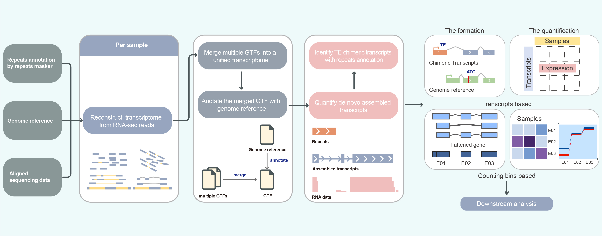

# **TEDDY**
# **T**ransposable **e**lement **d**e novo insertion **detecting** and chimeric transcripts identif**y**ing
**TEDDY** is a framework for TE insertion detection and chimeric transcripts identification.
<p align="center">

</p>


## 1.Getting Started
**1.2 Preparation**
To compile C code, use the following steps:
```{shell prepare, warning=FALSE, eval=FALSE,message=FALSE}
cd Teddy
cd Rstringtie/src
make
```
**1.2 Installation**
```{shell install, warning=FALSE, eval=FALSE,message=FALSE}
cd ../..
R CMD INSTALL TEi
R CMD INSTALL Rstringtie
```
**1.2 Initialization**
```{r init, warning=FALSE, eval=FALSE,message=FALSE}
library(TEi)
library(Rstringtie)
```

## 2. Detect de novo TE insertion sites
**2.1 Extract soft clip reads**
```{r extract, warning=FALSE, eval=FALSE, message=FALSE}
extractSoftClip(file = input, outfq = output)
```

**2.2 Align soft clip reads**
```{r align, warning=FALSE, eval=FALSE, message=FALSE}
alignment(reference = reference, fastq  = input, bamOutput = output, threads = threads)
```

**2.3 Identify the TE insertions**
```{r TEi, warning=FALSE, eval=FALSE, message=FALSE}
insertLocation(file = bamfile, outBed = outBed)
```

**2.4 Merge and filter the TE insertions**
```{r process, warning=FALSE, eval=FALSE, message=FALSE}
TEi::processInsertion(file = outBed)
```

## 3. Identify chimeric transcripts
**3.1 Assemble reads into transcripts by Stringtie**
```{r assemble, warning=FALSE, eval=FALSE, message=FALSE}
Rstringtie::stringtieAssembly(bam = bam, reference = reference, outfile = outfile)
```

**3.2 Merge various GTF files among different samples for a unified newly assembled reference**
```{r merge, warning=FALSE, eval=FALSE, message=FALSE}
Rstringtie::stringtieMerge(reference = reference, gtfFiles = gtfFiles, outfile = N_reference)
```

**3.3 Annotate the newly assembled reference via the genome reference**
```{r anno, warning=FALSE, eval=FALSE, message=FALSE}
Rstringtie::gffcompareAnno(reference = reference, gtfFile = N_reference, outfile = annoGTF)
```

**3.4 Flatten the transcripts into counting bins and annotate them via the annotated TE reference**
```{r repeats, warning=FALSE, eval=FALSE, message=FALSE}
anno <- Rstringtie::prepareAnno(gtfFile = N_reference, transposon = repeats)
```

**3.5 Count the reads falling into the counting bins among bam files**
```{r count, warning=FALSE, eval=FALSE, message=FALSE}
se <- countAnno(annotation = anno, bamfiles = bamfiles)
```

**3.6  Count the reads falling into the transcripts among bam files**
```{r count2, warning=FALSE, eval=FALSE, message=FALSE}
combineSE <- stringtieCombine(reference = N_reference, 
                              bamfile = bamfiles,
                              params = "-p 70", 
                              gtfFiles = gtfFiles)
```

**3.7 Detect to what extent TE-chimeric exon affect the expression of the corresponding transcript**

3.7.1 Fit the counts with the formula ~sample + TE-chimeric + condition:TE-chimeric and compare it to the null model ~ sample + TE-chimeric. TE-chimeric is a factor with two levels, which classified the exon as TE-chimeric exon or other exon. Compare the deviances of two GLM fits for each counting bin through χ2-distribution test and extract the result from the test .
```{r test, warning=FALSE, eval=FALSE, message=FALSE}
chi_test <- ChimericDrivenTest(SEobject = se, condition = condition)
results <- extractTest(object = chi_test)
```

3.7.2 Estimate relative fold changes of counts in the TE-chimeric exon among different conditions and versus other exons, calculated by a GLM fit based on the formula count ~ condition + TE-chimeric + condition:TE-chimeric. The interaction coefficient reflects that the fraction of the gene's reads of TE-chimeric exon differs significantly between the different experimental conditions. That is, TE-chimeric transcripts may play a role under different biological conditions. 
```{r foldchange, warning=FALSE, eval=FALSE, message=FALSE}
calculateFoldchange(object = chi_test, genes = genes, crossVar="condition")
```
