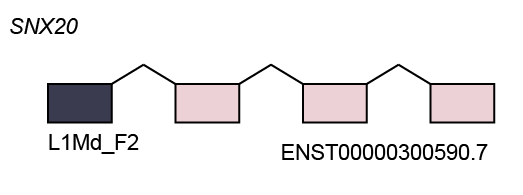
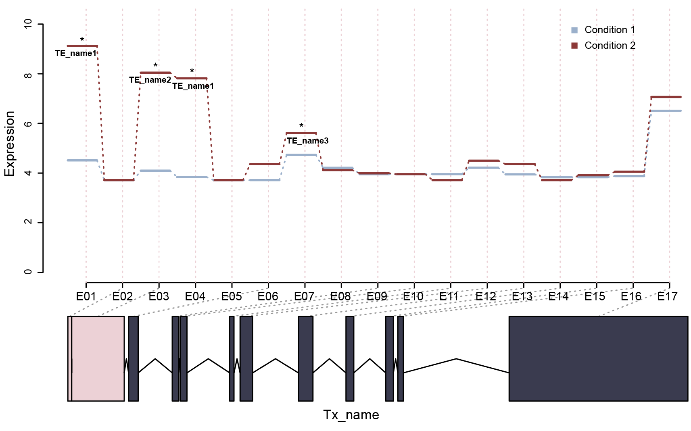
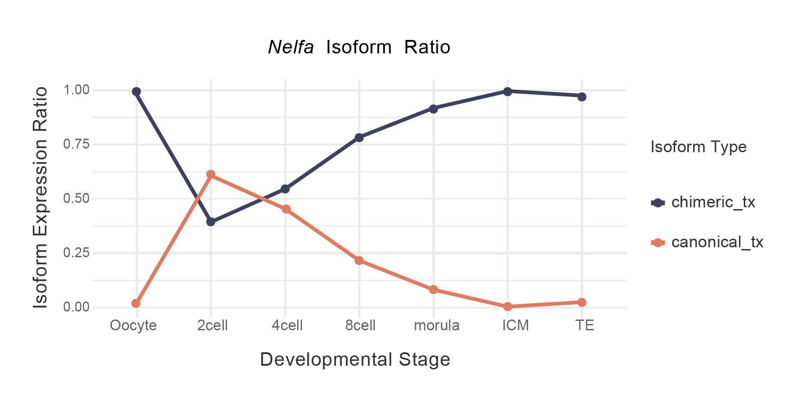

# Tutorial for Downstream Analysis

This tutorial introduces the downstream analysis modules available in
TEDDY. It requires output objects generated from the [core workflow
tutorial](https://yeehanxiao.github.io/Teddy/articles/core-workflow.md).
Users may adapt the analysis according to their study design, biological
question, and data type.

## 1. Prerequisites

Define the same `work_dir` used in the core workflow, and load the
required objects in each downstream module as needed.

``` r

library(Teddy)
work_dir <- "path/to/teddy_output"
annotated_gtf <- file.path(work_dir, "GTF", "annotated.gtf")
combineSE_file <- file.path(work_dir, "meta", "combineSE.rds")
te_file <- file.path(work_dir, "meta", "te_annotation.rds")
se_file <- file.path(work_dir, "meta", "se.rds")
anno_file <- file.path(work_dir, "meta", "anno.rds")
chi_GTF_file <- file.path(work_dir, "meta", "chi_GTF.rds")
```

## 2. Differential TE-chimeric exon usage analysis

TEDDY uses
[`ChimericDrivenTest()`](https://yeehanxiao.github.io/Teddy/reference/ChimericDrivenTest.md)
to test whether TE-chimeric exonic bins show condition-associated usage
changes relative to the other exonic bins from the same gene locus.

### 2.1 Run `ChimericDrivenTest()`

``` r

se <- readRDS(se_file)
anno <- readRDS(anno_file)

condition <- c(
  "control", "control", "control",
  "treatment", "treatment", "treatment"
)

chi_dds <- ChimericDrivenTest(
  SEobject = se,
  condition = condition,
  annotation = anno
)

saveRDS(
  chi_dds,
  file = file.path(work_dir, "meta", "chi_dds.rds")
)
```

**Notes**

- `SEobject` is the bin-level quantification object generated by
  [`countAnno()`](https://yeehanxiao.github.io/Teddy/reference/countAnno.md).
- `condition` should match the sample order in `se`.
- `annotation` is the TE-annotated exonic-bin annotation generated by
  [`prepareAnno()`](https://yeehanxiao.github.io/Teddy/reference/prepareAnno.md).
- The model tests whether the usage of TE-chimeric exonic bins changes
  across conditions relative to non-chimeric bins from the same gene
  locus.

### 2.2 Extract test results

``` r

chi_test <- extractTest(
  object = chi_dds,
  filter = TRUE
)

saveRDS(
  chi_test,
  file = file.path(work_dir, "meta", "chi_test.rds")
)
```

Example output:

``` text
LRT p-value: full vs reduced
DataFrame with n rows and 8 columns
                         groupID   featureID  exonExpr          TEclass dispersion      stat    pvalue      padj
                     <character> <character> <numeric>      <character>  <numeric> <numeric> <numeric> <numeric>
ENSMUSG00000000182.9 ENSMUSG...        E003     1.145 B3A,(CA)n,...       12.0000    0.201    0.654    1.000
ENSMUSG00000000266.10 ENSMUSG...       E021    15.564 MIRb,MER5A,L2a       0.2515    0.630    0.428    0.986
ENSMUSG00000000320.9 ENSMUSG...        E001     2.339 B1_Mus2,B1_Mus2      0.9155    0.101    0.751    1.000
ENSMUSG00000000320.9 ENSMUSG...        E007     0.810 RSINE1,B4A           1.3008    3.093    0.079    0.460
ENSMUSG00000000567.5 ENSMUSG...        E003     4.232 AT_rich,A-rich,...   2.2795    0.232    0.630    1.000
```

**Notes**

`filter = TRUE` removes uninformative all-zero rows.

### 2.3 Calculate fold changes

[`calculateFoldchange()`](https://yeehanxiao.github.io/Teddy/reference/calculateFoldchange.md)
can be used to estimate TE-chimeric exon usage fold changes for selected
candidate genes.

``` r

candidate_genes <- chi_test$groupID[chi_test$padj < 0.05]

fc_list <- calculateFoldchange(
  object = chi_dds,
  genes = candidate_genes,
  crossVar = "condition"
)

saveRDS(
  fc_list,
  file = file.path(work_dir, "meta", "chi_foldchange.rds")
)
```

**Notes**

- `candidate_genes` can be selected from
  [`extractTest()`](https://yeehanxiao.github.io/Teddy/reference/extractTest.md)
  results.
- `crossVar` should match the condition variable used in
  [`ChimericDrivenTest()`](https://yeehanxiao.github.io/Teddy/reference/ChimericDrivenTest.md).
- The returned object stores fold-change estimates for the selected
  TE-chimeric candidate loci.

## 3. Visualization module

### 3.1 Prepare exon-level GTF input for visualization

Several visualization functions require exon-level transcript structure
annotations. These records can be obtained either from the annotated GTF
generated by the core workflow or from the `combineSE` object.

**Option 1: use the annotated unified GTF generated in the core
workflow**

``` r

GTF <- extractGTF(
  gtfFile = annotated_gtf,
  filter = 1,
  type = "exon"
)
```

**Option 2: use the annotated GTF stored in `combineSE`**

``` r

combineSE <- readRDS(combineSE_file)

GTF <- extractGTF(
  combineSE = combineSE,
  filter = 1,
  type = "exon"
)
```

**Notes**

`filter` specifies the minimum FPKM threshold used when extracting
transcript structures.

### 3.2 Visualize TE-chimeric transcript structure with `formPlot()`

[`formPlot()`](https://yeehanxiao.github.io/Teddy/reference/formPlot.md)
displays the exon-chain structure of a selected transcript and
highlights the associated TE-derived exon.

``` r

chi_GTF <- readRDS(chi_GTF_file)
```

Select a candidate transcript and TE feature from `chi_GTF`:

``` r

txid <- chi_GTF$transcript_id[1]
geneName <- chi_GTF$gene_name[1]
TEname <- chi_GTF$TE_name[1]
```

Generate the transcript structure plot:

``` r

formPlot(
  GTF = GTF,
  txid = txid,
  rank = 1,
  geneName = geneName,
  TEname = TEname
)
```



**Notes**

`rank` indicates the transcript-order rank of the TE-overlapping exon
and can be obtained from the `tx_exon_rank` column in `chi_GTF`.

### 3.3 Visualize TE-associated bin-level expression with `diffBinPlot()`

[`diffBinPlot()`](https://yeehanxiao.github.io/Teddy/reference/diffBinPlot.md)
visualizes bin-level expression patterns for a selected candidate locus
together with the transcript structure and TE-associated exon.

``` r

se <- readRDS(se_file)
anno <- readRDS(anno_file)
```

Generate the bin-level visualization:

``` r

target_gene <- chi_test$groupID[1]
txid <- as.character(anno$tx_name[anno$gene_id == target_gene][[1]][1])


idx <- which(anno$gene_id == target_gene)
target_gene_name <- mapGeneName(target_gene, GTF)
count_mat <- SummarizedExperiment::assay(se)
condition <- c(
  "control", "control", "control",
  "treatment", "treatment", "treatment"
)
labels <- c("control", "treatment")

diffBinPlot(
  count = count_mat,
  conditions = condition,
  annotation = anno,
  idx = idx,
  labels = labels,
  Title = target_gene_name,
  gtf = GTF,
  txid = txid,
  chi_test = chi_test,
  gene_name = target_gene_name
)
```



**Notes**

- `count_mat` is extracted from the bin-level `SummarizedExperiment`
  generated by
  [`countAnno()`](https://yeehanxiao.github.io/Teddy/reference/countAnno.md).

- `annotation` is the bin-level annotation stored in `rowData(se)`.

- `chi_test` is the result extracted from
  [`ChimericDrivenTest()`](https://yeehanxiao.github.io/Teddy/reference/ChimericDrivenTest.md)
  as shown in Section 2.

### 3.4 Visualize TE-chimeric isoform dynamics

For illustration, we use `Nelfa` as an example candidate gene.

``` r

combineSE <- readRDS(combineSE_file)
chi_GTF <- readRDS(chi_GTF_file)
te <- readRDS(te_file)

gene <- "Nelfa"

chimeric_tx <- pick_chimeric_tx(
  gene = gene,
  combineSE = combineSE,
  te = te,
  return_all = FALSE
)

canonical_tx <- pick_canonical_tx(
  combineSE = combineSE,
  gene = gene,
  assay_name = "FPKM"
)

txid <- c(
  TE_chimeric = chimeric_tx,
  Canonical = canonical_tx
)

txid <- txid[!is.na(txid)]
```

**Notes**

Select a gene of interest. Candidate genes can be chosen from `chi_GTF`
or from significant results in `chi_test`.

``` r

group <- clean_sampleNames(colnames(combineSE))
group_order <- unique(group)

plotIsoformDynamics(
  combineSE = combineSE,
  txid = txid,
  gene_name = gene,
  assay_name = "FPKM",
  group = group,
  group_order = group_order,
  ratio = FALSE,
  cols = c(
     "#de7b60",
     "#3c415e"
  )
)
```


To compare relative isoform usage, set `ratio = TRUE`:

``` r

plotIsoformDynamics(
  combineSE = combineSE,
  txid = txid,
  gene_name = gene,
  assay_name = "FPKM",
  group = group,
  group_order = group_order,
  ratio = TRUE,
  cols = c(
      "#de7b60",
      "#3c415e"

  )
)
```



**Notes**

- `group` defines sample-level labels and can be derived from
  `colnames(combineSE)` using the helper function `clean_sampleNames`.

- `ratio = FALSE` plots transcript-level expression values;
  `ratio = TRUE` plots the relative fraction of selected isoforms within
  each group.

## 4. TE-chimeric sequence reconstruction and extraction

### 4.1 Prepare genome sequence object

Sequence extraction requires a `BSgenome` object that matches the genome
build used for your alignment and annotations (GTF/TE).

Here is how to load the commonly used mouse (mm10) or human (hg38)
assemblies:

``` r

# Mouse (mm10)
library(BSgenome.Mmusculus.UCSC.mm10)
genome <- BSgenome.Mmusculus.UCSC.mm10

# Human (hg38)
library(BSgenome.Hsapiens.UCSC.hg38)
genome <- BSgenome.Hsapiens.UCSC.hg38
```

### 4.2 Export transcript sequences

[`export_transcript()`](https://yeehanxiao.github.io/Teddy/reference/export_transcript.md)
extracts transcript sequences from exon structures, either concatenating
them into a single spliced sequence (`collapse = TRUE`) or returning
exons separately (`collapse = FALSE`).

``` r

tx_seq <- export_transcript(
  txid = txid,
  GTF = GTF,
  genome = genome,
  write = FALSE,
  collapse = TRUE
)

tx_seq
```

Example output:


To inspect exon sequences separately, set `collapse = FALSE`:

``` r

exon_seq <- export_transcript(
  txid = txid,
  GTF = GTF,
  genome = genome,
  write = FALSE,
  collapse = FALSE
)
exon_seq
```

Example output: 

**Notes**

- `txid` accepts one or multiple transcript IDs.
- `GTF` is generated by `extractGTF(type = "exon")`.
- `write = FALSE` returns sequences in R; `write = TRUE` exports FASTA
  files to `outdir`.

## 5. TF analysis module

### 5.1 Prepare a motif PWM

Users may obtain motif profiles from public databases such as JASPAR.
Here we use ARID3A as an example.

``` r

# Optional: Users can install them from Bioconductor
## BiocManager::install(c("JASPAR2022", "TFBSTools"))

library(JASPAR2022)
library(TFBSTools)

Arid3a_pfm <- getMatrixByID(JASPAR2022, ID = "MA0151.1")
Arid3a_pwm <- TFBSTools::toPWM(Arid3a_pfm)
pwm <- as.matrix(Arid3a_pwm@profileMatrix)
```

Optionally, users can provide their own probability matrix and convert
it with
[`pcmFunction()`](https://yeehanxiao.github.io/Teddy/reference/pcmFunction.md):

``` r

pcm <- read.table("path/to/motif_matrix.txt", header = TRUE)
colnames(pcm) <- c("A", "C", "G", "T")

pwm <- pcmFunction(pcm)
```

### 5.2 Search motifs in TE-associated regions

``` r

## Optional: only needed if starting from this section
# combineSE <- readRDS(combineSE_file)
# chi_GTF <- readRDS(chi_GTF_file)

te <- readRDS(te_file)
library(BSgenome.Mmusculus.UCSC.mm10)
genome <- BSgenome.Mmusculus.UCSC.mm10

motif_result <- MotifSearch(
  object = chi_GTF,
  te = te,
  pwm = pwm,
  genome = genome,
  minoverlap = 15,
  min.score = 0.9,
  filter = 2
)
```

The returned object contains TF motif sites, linked TE-chimeric
transcripts and the source TE regions.

``` r

names(motif_result)
```

``` text
[1] "match_results"   "overlap_results" "target_te"
```

``` r

motif_hits <- motif_result$match_results
motif_te <- motif_result$target_te
motif_candidates <- motif_result$overlap_results
```

**Notes**

- `object` requires `chi_GTF` generated by
  [`processGTF()`](https://yeehanxiao.github.io/Teddy/reference/processGTF.md).

- `genome` must match the same genome build, as detailed in Section 4.1.

- `filter` controls the minimum number of motif matches required to
  retain a TE-associated candidate.

- `minoverlap` defines the minimum overlap required between TE-chimeric
  features and TE annotations.

- `min.score` defines the minimum PWM match score for retaining motif
  hits.
