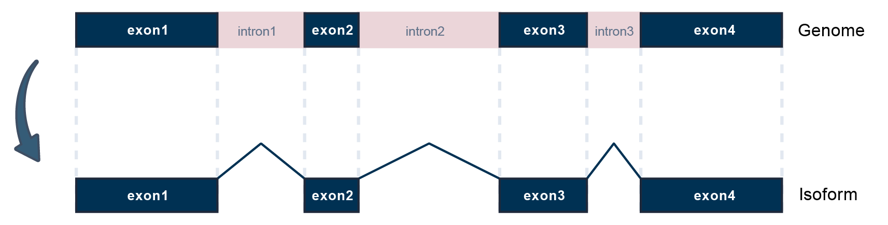
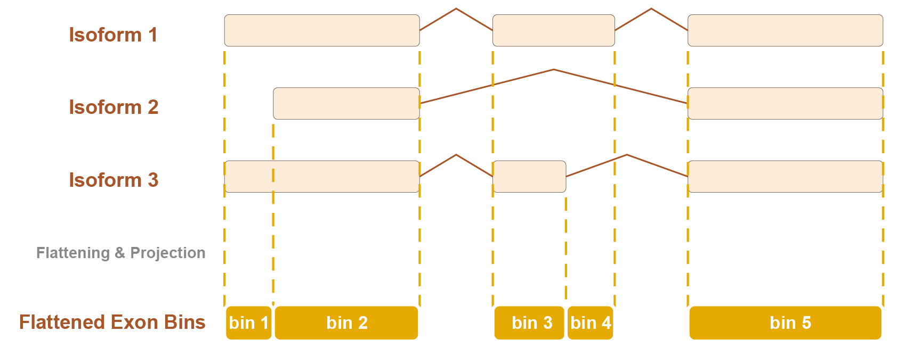

```{r, include = FALSE}
knitr::opts_chunk$set(
  collapse = TRUE,
  comment = "#>"
)
```

This tutorial features a copy-and-adapt workflow. Simply prepare your input files and update the paths in Section 1, then run the remaining sections sequentially.

## 1. Set up input and output paths

Define the input files and output directory used throughout the workflow.

### 1.1 Reference GTF

TEDDY requires a transcript- and exon-level reference annotation in GTF format. The reference GTF should match the genome build used for BAM alignment and TE annotation.

Users may download reference GTF files from public annotation resources such as GENCODE, Ensembl, or ENCODE.

Here we use Homo sapiens GENCODE v43 and Mus musculus GENCODE M7 as examples.

```{r download-human-reference-gtf, eval=FALSE}
## Example: human GENCODE v43
download.file(
  url = "https://ftp.ebi.ac.uk/pub/databases/gencode/Gencode_human/release_43/gencode.v43.annotation.gtf.gz",
  destfile = "gencode.v43.annotation.gtf.gz",
  mode = "wb"
)

R.utils::gunzip("gencode.v43.annotation.gtf.gz", remove = FALSE)
reference <- "gencode.v43.annotation.gtf"

```

```{r download-mouse-reference-gtf, eval=FALSE}
## Example: mouse GENCODE M7
download.file(
  url = "https://ftp.ebi.ac.uk/pub/databases/gencode/Gencode_mouse/release_M7/gencode.vM7.annotation.gtf.gz",
  destfile = "gencode.vM7.annotation.gtf.gz",
  mode = "wb"
)

R.utils::gunzip("gencode.vM7.annotation.gtf.gz", remove = FALSE)
reference <- "gencode.vM7.annotation.gtf"

```

### 1.2 Initialization and Project paths
```{r setup-paths, eval=FALSE}
suppressPackageStartupMessages({
  library(Teddy)
  library(SummarizedExperiment)
  library(S4Vectors)
  library(parallel)
})

reference <- "path/to/reference.gtf"
bam_dir   <- "path/to/sorted_bam"
work_dir <- "path/to/teddy_output"

dir.create(work_dir, recursive = TRUE, showWarnings = FALSE)
dir.create(file.path(work_dir, "gtf"), recursive = TRUE, showWarnings = FALSE)
dir.create(file.path(work_dir, "GTF"), recursive = TRUE, showWarnings = FALSE)
dir.create(file.path(work_dir, "meta"), recursive = TRUE, showWarnings = FALSE)

```

### 1.3 TE annotation preparation

TEDDY expects a `GRanges` object of TE annotations: coordinates in standard fields, metadata with a `names` column for downstream annotation.

```{r setup-te-file, eval=FALSE}
te_file <- file.path(work_dir, "meta", "te_annotation.rds")

```

#### Option 1: download prebuilt TE annotation objects

```{r download-te-annotation, eval=FALSE} 
#Choose one matching your genome build.
## Human hg38
#download.file(
  #url = "https://zenodo.org/records/21301845/files/hg38_TE.rds?download=1",
  #destfile = te_file,
  #mode = "wb"
#)

## Mouse mm10
download.file(
  url = "https://zenodo.org/records/21301845/files/mm10_TE.rds?download=1",
  destfile = te_file,
  mode = "wb"
)

te <- readRDS(te_file)

```


#### Option 2: construct a TE annotation object manually

Users may also construct the required `GRanges` object from a RepeatMasker-style BED or table.

```{r construct-te-annotation, eval=FALSE}
library(GenomicRanges)
library(IRanges)

te_table <- read.delim(
  "repeats_mm10.bed",
  header = TRUE,
  sep = "\t",
  stringsAsFactors = FALSE
)
te_table <- te_table[
  grep("(DNA)|(LINE)|(LTR)|(SINE)", te_table$repClass, perl = TRUE),
]
te <- GRanges(
  seqnames = te_table$genoName,
  ranges = IRanges(
    start = te_table$genoStart,
    end = te_table$genoEnd
  ),
  strand = te_table$strand,
  names = te_table$repName,
  class = te_table$repClass,
  family = te_table$repFamily
)

```

The resulting object should be a standard `GRanges` object with TE metadata columns

Harmonize chromosome naming and check the object

```{r NCBI, eval=FALSE}
te <- NCBI_check(te)
saveRDS(
  te,
  file = te_file
)
```

#### Option 3: use an existing TE annotation object

A compatible TE annotation object is already available.

```{r use-existing-te-annotation, eval=FALSE}
existing_te_file <- "path/to/existing_te_annotation.rds"
te <- readRDS(existing_te_file)
te <- NCBI_check(te)
saveRDS(
  te,
  file = te_file
)

```

Example:

```text

GRanges object with 6 ranges and 3 metadata columns:

      seqnames            ranges strand |       names       class      family

         <Rle>         <IRanges>  <Rle> | <character> <character> <character>

  [1]     chr1 67108752-67108881      + |  RLTR17B_Mm         LTR        ERVK
  [2]     chr1   8386825-8389555      - |         Lx2        LINE          L1
  [3]     chr1 16776988-16779051      + |     L1_Mus1        LINE          L1
  [4]     chr1 33554408-33554640      - |          B4        SINE          B4
  [5]     chr1 50329971-50335398      + |      L1Md_T        LINE          L1
  [6]     chr1 83885790-83886358      - |      L1Md_T        LINE          L1

```

**Notes**

- `bam_dir`: directory containing aligned and coordinate-sorted BAM files.

- `reference`: transcript- and exon-level annotation in GTF format, such as GENCODE, ENCODE, or Ensembl annotations.

- `te_file`: TE annotation object.

- `work_dir`: output directory for this analysis. Per-sample assembled GTF files are written to `gtf/`, merged and annotated GTF files are written to `GTF/`, and serialized R objects are written to `meta/`.

- `parallel`: recommended for per-sample transcript assembly. Users can adjust `mc.cores` according to available CPU resources.


## 2. Reconstruct transcripts for each sample

TEDDY uses StringTie to perform per-sample, reference-guided transcript assembly from aligned short-read RNA-seq BAM files, enabling local reconstruction of novel isoform structures.


```{r stringtie-assembly, eval=FALSE}
bamfiles <- list.files(
  bam_dir,
  pattern = "\\.bam$",
  full.names = TRUE
)

mclapply(
  bamfiles,
  FUN = function(x, reference, outdir) {
    bam <- basename(x)
    outfile <- file.path(outdir, sub("\\.bam$", ".gtf", bam))
    Teddy::stringtieAssembly(
      bam = x,
      reference = reference,
      outfile = outfile,
      params = "-p 8"
    )
  },
  reference = reference,
  outdir = file.path(work_dir, "gtf"),
  mc.cores = 8
)
```

For long-read data, such as ONT or PacBio RNA-seq, use the same per-sample workflow and set `longRead = TRUE`:

```{r stringtie-assembly-longread, eval=FALSE}
bamfiles <- list.files(
  bam_dir,
  pattern = "\\.bam$",
  full.names = TRUE
)

mclapply(
  bamfiles,
  FUN = function(x, reference, outdir) {
    bam <- basename(x)
    outfile <- file.path(outdir, sub("\\.bam$", ".gtf", bam))
    Teddy::stringtieAssembly(
      bam = x,
      reference = reference,
      outfile = outfile,
      params = "-p 8",
      longRead = TRUE
    )
  },
  reference = reference,
  outdir = file.path(work_dir, "gtf"),
  mc.cores = 4
)
```

**Notes**

The `params` argument passes additional options to StringTie. In the example above, `params = "-p 8"` allocates 8 threads for each sample-level assembly.

Several StringTie parameters are particularly relevant for TE-chimeric transcript reconstruction:

- **`-j`**: minimum junction coverage. Increasing this threshold makes splice-junction evidence more stringent, but may remove low-coverage TE-chimeric junctions.

- **`-c`**: minimum read coverage for assembled transcripts. Higher values reduce weakly supported transcript fragments but may also remove low-abundance isoforms.

- **`-s`**: minimum coverage for single-exon transcripts. This is useful for controlling weak single-exon fragments.

- **`-f`**: minimum isoform fraction. Higher values retain only relatively abundant isoforms within a locus, whereas lower values are more permissive for minor isoforms.

- **`-a`**: minimum anchor length for junctions. This helps filter splice junctions supported only by very short anchors.

- **`-m`**: minimum assembled transcript length. This removes very short transcript fragments.

- **`-M`**: maximum fraction of a bundle allowed to be covered by multi-mapping reads. This can be useful in repeat-rich regions, including TE-associated loci.

Users can adjust these parameters through `params` according to sequencing depth, library complexity, and the desired balance between sensitivity and specificity. For example:

```{r stringtie-assembly-params, eval=FALSE}
Teddy::stringtieAssembly(
  bam = "sample.bam",
  reference = reference,
  outfile = "sample.gtf",
  params = "-p 8 -j 2 -c 1 -f 0.01"
)
```

## 3. Multi-sample harmonization

### 3.1 Merge transcript assemblies across samples

After per-sample reconstruction, TEDDY uses `stringtieMerge()` to combine all assembled GTF files. This step harmonizes transcript isoforms across samples and reduces redundant transcript structures.

```{r merge-assemblies, eval=FALSE}
gtffiles <- list.files(
  file.path(work_dir, "gtf"),
  pattern = "\\.gtf$",
  full.names = TRUE
)

stringtieMerge(
  reference = reference,
  gtfFiles = gtffiles,
  outfile = file.path(work_dir, "GTF", "merged.gtf"),
  params = "-p 8"
)

```

The merged GTF file is written to:

```text
short_read_teddy_output/GTF/merged.gtf
```

**Notes**

The `params` argument passes additional options to StringTie merge mode. In the example above, `params = "-p 8"` uses 8 threads.

For TE-chimeric transcript analysis, the following merge-mode parameters are particularly relevant:

- **`-m`**: minimum input transcript length to include in the merge. The StringTie default is `50`.

- **`-c`**: minimum input transcript coverage to include in the merge. The StringTie default is `0`.

- **`-F`** and **`-T`**: minimum FPKM and TPM thresholds for input transcripts. The StringTie defaults are `1.0` for both. Lowering these thresholds can retain low-abundance transcript models for downstream TE-chimeric inspection.

- **`-f`**: minimum isoform fraction. The StringTie default is `0.01`.

- **`-g`**: maximum gap between transcripts to merge together. The StringTie default is `250`.

Users can adjust these thresholds according to sequencing depth, library complexity, and the expected abundance of TE-chimeric isoforms. More permissive settings may help retain low-abundance TE-associated structures, whereas more stringent settings reduce weakly supported transcript fragments.

```{r merge-assemblies-params, eval=FALSE}
stringtieMerge(
  reference = reference,
  gtfFiles = gtffiles,
  outfile = file.path(work_dir, "GTF", "merged.gtf"),
  params = "-p 8 -m 50 -c 0 -F 0 -T 0"
)
```

The example above uses a permissive merge setting by lowering the FPKM and TPM thresholds to `0`. This may be useful for retaining low-abundance TE-chimeric candidates, but users may choose more stringent thresholds for noisy datasets.

### 3.2 Annotate and consolidate merged reference

TEDDY uses `gffcompareAnno()` to compare the merged transcriptome reference against the input reference GTF. This step assigns transcript class-code information and generates a standardized annotated GTF.


```{r gffcompare-annotation, eval=FALSE}
gffcompareAnno(
  reference = reference,
  gtffile = file.path(work_dir, "GTF", "merged.gtf"),
  outfile = file.path(work_dir, "GTF", "annotated.gtf"),
  overwrite = TRUE
)
```

The annotated GTF file is written to:

```text
short_read_teddy_output/GTF/Teddy.annotated.gtf
```

## 4. Annotate TE-overlapping transcript features

TEDDY uses `prepareAnno()` to convert the annotated transcript GTF into exon-level transcript features and annotate TE-chimeric exons. The output is a `GRanges` object in which each range represents an exonic part associated with transcript, gene, exon-rank, and TE-overlap information.

```{r prepare-annotation, eval=FALSE}
anno <- prepareAnno(
  gtffile = file.path(work_dir, "GTF", "annotated.gtf"),
  transposon = te,
  cores = 8
)

saveRDS(anno, file = file.path(work_dir, "meta", "anno.rds"))
```

Example output:

```text
GRanges object with 5 ranges and 8 metadata columns:
      seqnames          ranges strand |         tx_id              tx_name
         <Rle>       <IRanges>  <Rle> | <IntegerList>      <CharacterList>
  [1]     chr1 3073253-3074322      + |             1 ENSMUST00000193812.1
  [2]     chr1 3102016-3102125      + |             2 ENSMUST00000082908.1
  [3]     chr1 3252757-3253236      + |             3 ENSMUST00000192857.1
  [4]     chr1 3466587-3466687      + |             4 ENSMUST00000161581.1
  [5]     chr1 3513405-3513553      + |             4 ENSMUST00000161581.1
                   gene_id       exon_id       exon_name     exon_rank exonic_part
               <character> <IntegerList> <CharacterList> <IntegerList>   <integer>
  [1]              MSTRG.5             1                             1           1
  [2] ENSMUSG00000064842.1             2                             1           1
  [3]             MSTRG.16             3                             1           1
  [4]             MSTRG.21             4                             1           1
  [5]             MSTRG.21             5                             2           2
            transposon
            <character>
  [1] L1_Mus3,Charlie2b
  [2]              none
  [3]              none
  [4]              none
  [5]              none
```

**Notes**

- `tx_id` and `tx_name` store the transcript identifiers.
- `gene_id` stores the corresponding gene locus.
- `exon_rank` records the exon position within the transcript exon chain in strand-aware order.
- `exonic_part` indexes the flattened exonic segment within the corresponding gene locus in strand-aware order.
- `transposon` stores the associated TE name of the TE-chimeric exons. 


## 5. Transcript-level expression and quantification



### 5.1 Transcript-level quantification

TEDDY uses `stringtieCombine()` to re-quantify the annotated unified transcriptome GTF across all BAM files. The output is a `RangedSummarizedExperiment` object that stores both transcript-level expression matrices and the corresponding transcript structure annotation.

```{r stringtie-combine, eval=FALSE}
combineSE <- stringtieCombine(
  reference = file.path(work_dir, "GTF", "annotated.gtf"),
  params = "-p 8",
  gtfFiles = gtffiles,
  bamFiles = bamfiles,
  longRead = FALSE,
  cores = 4
)

```

For long-read data, use the same annotated unified GTF and set `longRead = TRUE`:

```{r stringtie-combine-longread, eval=FALSE}
combineSE_longread <- stringtieCombine(
  reference = file.path(work_dir, "GTF", "annotated.gtf"),
  params = "-p 8",
  gtfFiles = gtffiles,
  bamFiles = bamfiles,
  longRead = TRUE,
  cores = 4
)

```

### 5.2 The transcript-level expression matrices can be extracted from the assays:

```{r extract-transcript-expression, eval=FALSE}
cov_mat  <- SummarizedExperiment::assay(combineSE, "cov")
fpkm_mat <- SummarizedExperiment::assay(combineSE, "FPKM")
tpm_mat  <- SummarizedExperiment::assay(combineSE, "TPM")
```

The transcript structure annotation is stored in the object metadata:

```{r inspect-combineSE-annotation, eval=FALSE}
metadata(combineSE)$gtf
```

### 5.3 Save the transcript-level output:

```{r saveCOMBINE, eval=FALSE}
saveRDS(
  combineSE,
  file = file.path(work_dir, "meta", "combineSE.rds")
)
```

Example output:

```text
class: RangedSummarizedExperiment
dim: <number of transcripts> <number of samples>
metadata(1): gtf
assays(3): cov FPKM TPM
rowData: transcript-level annotation
colData: sample information
```

## 6. Bin-level expression and quantification



### 6.1 Bin-level quantification
TEDDY uses `countAnno()` to quantify reads over TE-annotated exonic bins. The output is a `SummarizedExperiment` object that stores bin-level count matrices together with the corresponding exon, transcript, gene, and TE-chimeric annotation.

For short-read data: 

```{r count-annotation, eval=FALSE}

se <- countAnno(
  annotation = anno,
  bamfile = bamfiles,
  nthreads = 8
)
```

For long-read BAM files, use long-read counting setting:

```{r count-annotation-longread, eval=FALSE}
se <- countAnno(
  annotation = anno,
  bamfile = bamfiles,
  isLongRead = TRUE,
  isPairedEnd = FALSE,
  strandSpecific = 0,
  nthreads = 8
)
```


### 6.2 The bin-level count matrix can be extracted from the assay:

```{r extract-bin-counts, eval=FALSE}
count_mat <- SummarizedExperiment::assay(se)
```

For the bin-level structure annotation:

```{r inspect-bin-annotation, eval=FALSE}
SummarizedExperiment::rowData(se)
```

### 6.3 Save the bin-level output:

```{r save-annoSE, eval=FALSE}
saveRDS(
  se,
  file = file.path(work_dir, "meta", "se.rds")
)
```

Example output:

```text
class: RangedSummarizedExperiment
dim: <number of exonic bins> <number of samples>
metadata(0):
assays(1): counts
rownames: bin IDs
rowData: exon-, transcript-, gene-, and TE-chimeric annotation
colData: sample information
```

**Notes**

- `countAnno()` performs bin-level quantification over the TE-annotated exonic bins generated by `prepareAnno()`.

## 7. Extract TE-chimeric transcript features

After transcript-level quantification, TEDDY provides `processGTF()` to extract TE-chimeric transcript features from the annotated unified GTF. This step identifies transcript exons whose genomic coordinates intersect TE annotations, and returns the corresponding transcript structures with TE name, family, and class information.

```{r process-gtf, eval=FALSE}
chi_GTF <- processGTF(
  te = te,
  combineSE = combineSE,
  minoverlap = 5,
  threads = 8
)

saveRDS(
  chi_GTF,
  file = file.path(work_dir, "meta", "chi_GTF.rds")
)

```

The output is a `GRanges` object containing TE-chimeric transcript features:

Example output:

```text
GRanges object with 69281 ranges and 17 metadata columns:

          seqnames            ranges strand |    source     type        transcript_id
             <Rle>         <IRanges>  <Rle> |  <factor> <factor>          <character>

      [1]     chr1   3073253-3074322      + | StringTie     exon ENSMUST00000193812.1
      [2]     chr1   3680155-3681788      + | HAVANA        exon ENSMUST00000193244.1
      [3]     chr1   3752010-3754360      + | HAVANA        exon ENSMUST00000194454.1
      [4]     chr1   4496551-4499378      + | StringTie     exon ENSMUST00000193450.1
      [5]     chr1   4844963-4846783      + | StringTie     exon          MSTRG.138.1
      ...
              gene_id     gene_name exon_number tx_exon_rank            TE_name    TE_class
          <character>   <character> <character>  <character>        <character> <character>
      [1]     MSTRG.4 4933401J01Rik           1            1  L1_Mus3,Charlie2b    LINE,DNA
      [2] ENSMUSG...       Gm10568           1            1    RMER20B,RLTR9A3     LTR,LTR
      [3] ENSMUSG...       Gm38385           1            1 L1_Mur3,RLTR51B_Mm    LINE,LTR
      [4]    MSTRG.47       Gm37587           1            1            B1_Mus1        SINE
      [5]   MSTRG.138        Lypla1           9            9            B1_Mur3        SINE
```

**Notes**

- `combineSE` / `gtfPath`: `processGTF()` is flexible and accepts either a `SummarizedExperiment` object (via `combineSE`) or a direct file path to an annotated GTF (via `gtfPath`). 
- `te`: TE annotation object prepared in Section 1.2.
- `minoverlap`: minimum overlap length between a transcript exon and TE annotation. A higher `minoverlap` threshold ensures more rigorous identification of TE-derived transcripts.
- `threads`: number of threads used.


## 8. Cross-platform integration

This section demonstrates how to generate a unified cross-platform transcriptome reference. Replace the paths below with the platform-specific `annotated.gtf` files generated by the workflow above.

### 8.1 Define platform-specific annotated GTF files

```{r cross-platform-gtfs, eval=FALSE}
platform_gtfs <- c(
  Illumina = "path/to/illumina_teddy_output/GTF/annotated.gtf",
  ONT      = "path/to/ont_teddy_output/GTF/annotated.gtf",
  PacBio   = "path/to/pacbio_teddy_output/GTF/annotated.gtf"
)
```

### 8.2 Build a unified cross-platform transcriptome reference

TEDDY uses `stringtieMerge()` to merge platform-specific annotated GTF files into a unified cross-platform transcriptome reference. This step consolidates transcript structures reconstructed from different sequencing platforms.

```{r cross-platform-merge, eval=FALSE}
cross_platform_gtf <- file.path(
  work_dir,
  "GTF",
  "cross_platform_pool.gtf"
)

stringtieMerge(
  reference = reference,
  gtfFiles = platform_gtfs,
  outfile = cross_platform_gtf,
  params = "-p 8"
)

```


### 8.3 Generate an isoform support matrix

After building the unified cross-platform reference, TEDDY uses `buildIsoformSupport()` to compare each platform-specific GTF against the unified reference. The resulting table records whether each transcript structure is exactly supported by each platform.

```{r cross-platform-support, eval=FALSE}
platform_support <- buildIsoformSupport(
  reference = cross_platform_gtf,
  gtffiles = platform_gtfs,
  conditions = names(platform_gtfs),
  out_dir = file.path(work_dir, "GTF", "cross_platform_compare"),
  out_prefix = "platform",
  cores = 4
)

saveRDS(
  platform_support,
  file = file.path(work_dir, "meta", "cross_platform_isoform_support.rds")
)

```

**Notes**

- By default, support is defined as exact structural concordance between a platform-specific transcript and the unified reference.

- If an `FPKM` matrix is provided, `threshold` can be used to require transcript-level expression support in addition to structural concordance.


### 8.4 Extract cross-platform TE-chimeric isoform support

The unified cross-platform GTF can be further annotated with TE overlaps using `processGTF()`. This allows users to restrict the isoform support matrix to TE-chimeric transcripts.

```{r cross-platform-te-support, eval=FALSE}
chi_GTF_cross_platform <- processGTF(
  te = te,
  gtfPath = cross_platform_gtf,
  minoverlap = 5,
  threads = 8
)

te_tx <- unique(chi_GTF_cross_platform$transcript_id)
te_platform_support <- platform_support[
  platform_support$tx_id %in% te_tx,
]


saveRDS(
  chi_GTF_cross_platform,
  file = file.path(work_dir, "meta", "cross_platform_chi_GTF.rds")
)
saveRDS(
  te_platform_support,
  file = file.path(work_dir, "meta", "cross_platform_te_isoform_support.rds")
)

```

Example output:

```text
# A tibble: <number of transcripts> × 6
  TCONS       gene_id          tx_id           Illumina ONT   PacBio
  <chr>       <chr>            <chr>           <lgl>    <lgl> <lgl>
  TCONS_00001 ENSG00000123456  ENST00000123456 TRUE     TRUE  FALSE
  TCONS_00002 MSTRG.12         MSTRG.12.1      TRUE     FALSE TRUE
  TCONS_00003 ENSG00000234567  ENST00000234567 FALSE    TRUE  TRUE
```

**Notes**

- The resulting object can be used for downstream platform-overlap summaries, TE-chimeric transcript recovery analysis, and visualization.